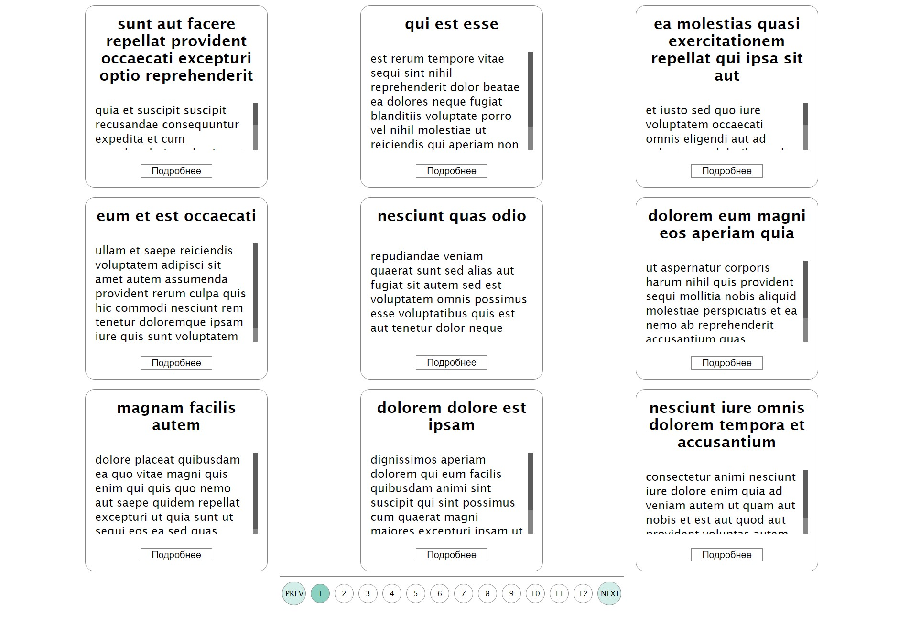
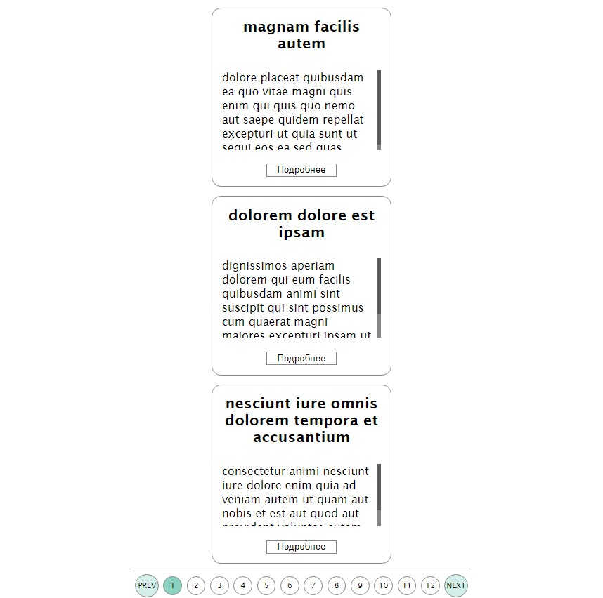
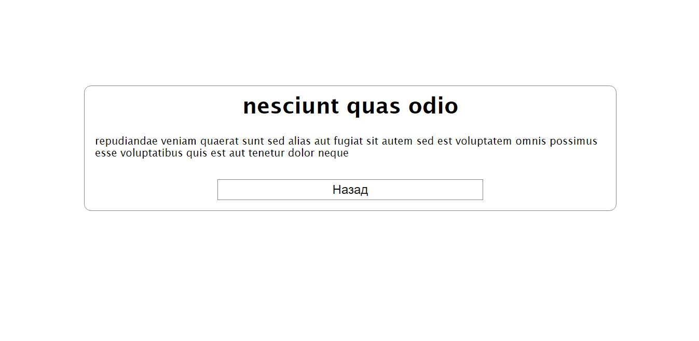

# Cards-pagination

## Описание
Небольшой проект для верстки списков с пагинацией

## Стек 
HTML, CSS, React, React-Router

## Особенности
1. Адаптивная верстка;
2. Пагинация с автоматическим рассчетом количества страниц;
3. Спиннер загрузки, если долго грузятся данные с API;
4. Подгрузка карточки при обновлении страницы с подробностями;

На gh-pages не выложен, потому что присутствует роутинг, с которым gh-pages не дружит

В качестве API использовался https://jsonplaceholder.typicode.com/

## Скриншоты:

### Список с адаптивом:

  
  
  

### Отдельная карточка:

  

## Управление
### `npm start`
Runs the app in the development mode.

### `npm test`
Launches the test runner in the interactive watch mode.

### `npm run build`
Builds the app for production to the `build` folder.
